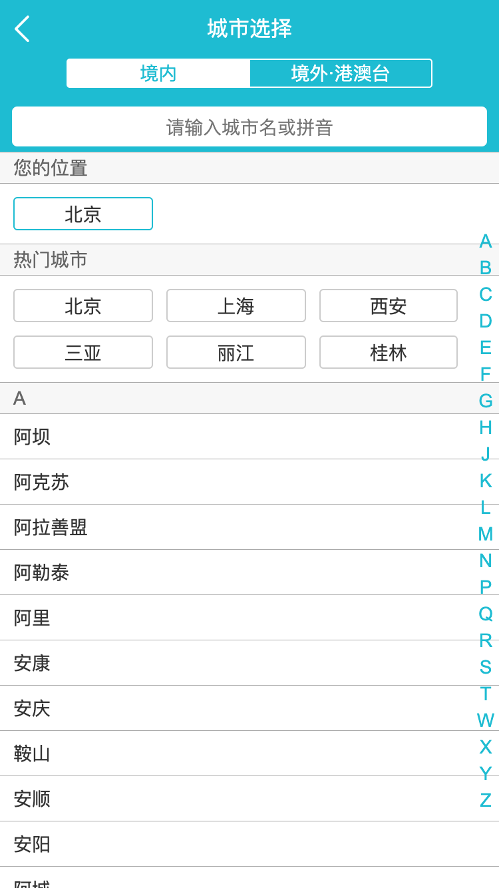

# QunarTravel
[English](README.md) / 中文

这是一个使用Vue框架模拟去哪儿网App的项目展示。  

## 展示
您可以在此位置[单击](https://gengjian1203.github.io/qunartravel/dist)在线查看项目。  
  
以下是项目的预览：  
<figure class="third">
    
</figure>

## 项目用到的技术
* Vue  
Vue.js 是一套基于MVVM的渐进式框架。  
采用自底向上增量开发的设计。  
具有较完善的生态系统。  
  
* Vue CLI  
是 Vue.js 官方提供的快速搭建项目的脚手架工具。  
  
* Vue Router  
Vue Router 是 Vue.js 官方的路由管理器。  
  
* Vuex  
Vuex 是一个专为 Vue.js 应用程序开发的状态管理模式。  
它采用集中式存储管理应用的所有组件的状态，  
并以相应的规则保证状态以一种可预测的方式发生变化。  
  
* axios  
基于 promise 用于浏览器和node.js的http客户端。  
  
* iconfont  
国内功能很强大且图标内容很丰富的矢量图标库，  
可以提供矢量图标下载、在线存储、格式转换等功能。  
  
* stylus  
一个 CSS 的预处理框架。  
  
* better-scroll  
better-scroll 是一款重点解决移动端（已支持 PC）各种滚动场景需求的插件。  
是基于原生 JS 实现的，不依赖任何框架，是一款非常轻量的 JS lib。  
  
* vue-awesome-swiper  
基于 Swiper4、适用于 Vue 的轮播组件，支持服务端渲染和单页应用。  
  
* keep-alive  
keep-alive 是 Vue 提供的一个抽象组件，用来对组件进行缓存，从而节省性能。  

* ESLink  
ESLint 是在 ECMAScript/JavaScript 代码中识别和报告模式匹配的工具。  
它的目标是保证代码的一致性和避免错误。  
  
### 环境
* 硬件环境  
MacBook Pro  
* 软件环境  
MacOS (10.14.2)    
Sublime Text (Build 3132)  
Google Chrome (75.0.3770.100)  
Firefox (67.0.4)  
node (v10.15.3)  
npm (6.4.1)  
vue (2.5.2)  
vue-awesome-swiper (2.6.7)  
vue-router (3.0.1)  
vuex (3.1.1)  
axios (0.19.0)  
stylus (0.54.5)  
  
## 项目安装/搭建

``` bash
# install dependencies
npm install

# serve with hot reload at localhost:8080
npm run dev

# build for production with minification
npm run build

# build for production and view the bundle analyzer report
npm run build --report
```

For a detailed explanation on how things work, check out the [guide](http://vuejs-templates.github.io/webpack/) and [docs for vue-loader](http://vuejs.github.io/vue-loader).
